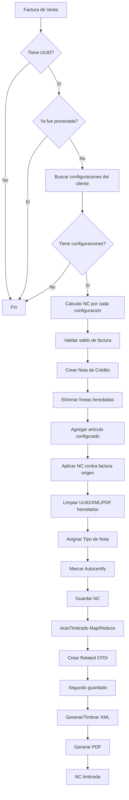

# Desarrollo de Notas de Crédito Automáticas por Cliente en NetSuite

## 1. Objetivo

Automatizar la creación de Notas de Crédito (NC) a partir de Facturas de Venta timbradas, utilizando una configuración por cliente para determinar cuántas NC deben generarse, qué artículo de servicio utilizar, qué concepto corresponde, qué porcentaje aplicar, qué importe calcular tomando como base el subtotal de la factura, cómo aplicar cada NC contra la factura origen y cómo integrarlas al proceso existente de AutoTimbrado.

## 2. Alcance

El proceso cubre:

1. Detección de factura timbrada.
2. Validación de cliente con configuración activa.
3. Cálculo de NC usando el subtotal de la factura.
4. Creación de una o varias NC.
5. Aplicación automática de cada NC contra la factura origen.
6. Prevención de duplicados.
7. Limpieza de datos fiscales heredados de la factura.
8. Asignación del tipo de Nota de Crédito.
9. Marcado para autocertificación.
10. Integración con el proceso existente de AutoTimbrado.
11. Creación de Related CFDI.
12. Segundo guardado previo al timbrado.
13. Generación de XML, UUID y PDF mediante el proceso de timbrado existente.

## 3. Arquitectura general



## 4. Componentes

### 4.1 User Event - NC automáticas por cliente

**Tipo:** User Event Script  
**Registro:** Factura de Venta  
**Evento principal:** `afterSubmit`

Responsabilidades:

- Validar que la factura tenga UUID.
- Validar que no haya sido procesada anteriormente.
- Obtener cliente y subtotal.
- Consultar reglas configuradas para el cliente.
- Crear una NC por cada configuración.
- Aplicar cada NC contra la misma factura.
- Evitar duplicados.
- Limpiar datos fiscales heredados.
- Asignar Tipo de Nota de Crédito.
- Marcar autocertificación.
- Marcar la factura como procesada una vez concluido el proceso.

### 4.2 Registro personalizado - Clientes Descuento

**ID del registro:**

```text
customrecord_nc_cliente_desc
```

Campos:

| Campo | ID |
|---|---|
| Cliente | `custrecord_nc_config_cliente` |
| Artículo | `custrecord_nc_articulo` |
| Concepto | `custrecord_nc_concepto` |
| Porcentaje | `custrecord_nc_porcentaje` |

Cada registro representa una regla independiente. Un cliente puede tener varias reglas activas y por tanto generar varias NC.

Ejemplo CITY FRESKO:

| Cliente | Artículo | Concepto | Porcentaje |
|---|---|---|---:|
| CITY FRESKO | AS004 | Fee y servicios logísticos | 2.99% |
| CITY FRESKO | AS006-A | Fluctuación | 2.00% |
| CITY FRESKO | AS012 | Publicidad | 1.50% |

## 5. Campos utilizados

### Factura de Venta

| Uso | ID |
|---|---|
| UUID CFDI | `custbody_mx_cfdi_uuid` |
| Factura procesada | `custbody_nc_auto_procesadas` |

### Nota de Crédito

| Uso | ID |
|---|---|
| Configuración origen | `custbody_nc_auto_config_origen` |
| Tipo de Nota de Crédito | `custbody_efx_nota_cre_tipo` |
| Autocertificación | `custbody_efx_fe_autocertify` |

## 6. Cálculo del importe

La base de cálculo es el campo nativo:

```text
subtotal
```

Fórmula:

```text
Importe base NC = Subtotal factura × Porcentaje configuración
```

Ejemplo CITY FRESKO:

```text
Subtotal = 51,473.71
```

| Concepto | % | Importe base |
|---|---:|---:|
| Fee logístico | 2.99% | 1,539.06 |
| Fluctuación | 2.00% | 1,029.47 |
| Publicidad | 1.50% | 772.11 |
| **Total base** | **6.49%** | **3,340.64** |

Los impuestos son calculados por NetSuite de acuerdo con el artículo configurado.

## 7. Creación de la Nota de Crédito

La NC se crea transformando la factura:

```javascript
record.transform({
    fromType: record.Type.INVOICE,
    fromId: invoiceId,
    toType: record.Type.CREDIT_MEMO,
    isDynamic: true
});
```

Después:

1. Se eliminan las líneas originales heredadas.
2. Se agrega únicamente el artículo configurado.
3. Se asigna cantidad = 1.
4. Se establece precio personalizado.
5. Se asigna el importe calculado.
6. Se mantiene `createdfrom` hacia la factura origen.
7. Se aplica la NC contra la factura origen.

## 8. Prevención de duplicados

La lógica valida la combinación:

```text
Factura origen + Configuración origen
```

Antes de crear una NC se busca si ya existe una Nota de Crédito con:

- `createdfrom = factura`
- `custbody_nc_auto_config_origen = configuración`

Si ya existe una NC válida, no se vuelve a crear.

## 9. Aplicación contra la factura

Cada NC se aplica únicamente a la factura que le dio origen.

Sublista:

```text
apply
```

Campos principales:

```text
doc
apply
amount
```

La lógica desmarca aplicaciones heredadas, localiza la factura origen, marca `apply = true` y aplica el total completo de la NC.

## 10. Limpieza de datos fiscales heredados

Antes de guardar la NC se limpian:

```text
custbody_mx_cfdi_uuid
custbody_mx_plus_xml_certificado
custbody_mx_plus_xml_generado
custbody_edoc_generated_pdf
```

Resultado esperado antes del timbrado:

| Campo | Estado |
|---|---|
| UUID propio NC | Vacío |
| XML certificado | Vacío |
| XML generado | Vacío |
| PDF | Vacío |

## 11. Tipo de Nota de Crédito

Campo:

```text
custbody_efx_nota_cre_tipo
```

Durante las pruebas se utilizó:

```text
REBAJA SOBRE VENTA
```

> Importante: no depender de IDs numéricos entre Sandbox y Producción.

## 12. Autocertificación

Al crear la NC se marca:

```text
custbody_efx_fe_autocertify = true
```

Ejemplo:

```javascript
creditMemo.setValue({
    fieldId: 'custbody_efx_fe_autocertify',
    value: true
});
```

## 13. EFX FE - Relación NC

Registro:

```text
customrecord_efx_fe_related_nc
```

Campos:

| Campo | ID |
|---|---|
| Tipo de Nota de Crédito | `custrecord_efx_fe_nc_type` |
| Tipo de Relación CFDI | `custrecord_efx_fe_relatedtype_nc` |
| Uso CFDI | `custrecord_efx_fe_cfdiusage_related` |
| Forma de pago | `custrecord_efx_fe_payform_rel` |
| Método de pago | `custrecord_efx_fe_metothpay_rel` |

Configuración utilizada durante pruebas:

```text
Tipo NC: REBAJA SOBRE VENTA
Relación CFDI: 01 - Nota de Crédito de los Documentos Relacionados
Uso CFDI: G02 - Devoluciones, Descuentos o Bonificaciones
Forma de pago: 03 - Transferencia Electrónica de Fondos
Método de pago: PUE - Pago en una Sola Exhibición
```

## 14. Related CFDI

Registro:

```text
customrecord_mx_related_cfdi_subl
```

Campos:

| Uso | ID |
|---|---|
| Transacción origen | `custrecord_mx_rcs_orig_trans` |
| Tipo de relación | `custrecord_mx_rcs_rel_type` |
| CFDI relacionado | `custrecord_mx_rcs_rel_cfdi` |
| UUID relacionado | `custrecord_mx_rcs_uuid` |

Resultado esperado:

```text
Relationship Type:
01 - Nota de Crédito de los Documentos Relacionados

Related CFDI:
Factura origen

UUID:
UUID de la factura origen
```

## 15. AutoTimbrado

El proceso de AutoTimbrado es un Map/Reduce alimentado por una búsqueda guardada.

Parámetro de búsqueda:

```text
custscript_efx_fe_autotimbrado_bg
```

La búsqueda debe devolver como mínimo:

- Tipo de transacción.
- UUID propio de la NC.
- Created From.
- Applied To Transaction.
- Tipo de la transacción relacionada.
- UUID de Applied To Transaction.
- Tipo de Nota de Crédito.

Propiedades consumidas:

```text
type
createdfrom
appliedtotransaction
type.createdFrom
type.appliedToTransaction
custbody_mx_cfdi_uuid
custbody_mx_cfdi_uuid.appliedToTransaction
custbody_efx_nota_cre_tipo
```

## 16. Ajustes realizados al AutoTimbrado

Durante las pruebas se detectaron errores:

```text
TypeError: Cannot read property 'value' of undefined
```

Se modificó la lectura de resultados para evitar accesos directos a propiedades inexistentes.

Ejemplo:

```javascript
var appliedTransaction =
    data_reduce.appliedtotransaction &&
    data_reduce.appliedtotransaction.value
        ? data_reduce.appliedtotransaction.value
        : '';
```

También se agregó respaldo para el tipo de transacción relacionada:

```javascript
var tipoRelacionTran = '';

if (
    data_reduce['type.createdFrom'] &&
    data_reduce['type.createdFrom'].value
) {
    tipoRelacionTran =
        data_reduce['type.createdFrom'].value;

} else if (
    data_reduce['type.appliedToTransaction'] &&
    data_reduce['type.appliedToTransaction'].value
) {
    tipoRelacionTran =
        data_reduce['type.appliedToTransaction'].value;
}
```

## 17. Segundo guardado

Después de generar Related CFDI, el AutoTimbrado vuelve a cargar y guardar la NC:

```javascript
var recordTipoCfdi = record.load({
    type: tipoTransaccion,
    id: id,
    isDynamic: true
});

recordTipoCfdi.save({
    enableSourcing: false,
    ignoreMandatoryFields: true
});
```

## 18. Flujo de timbrado

```text
NC
→ Related CFDI
→ Segundo guardado
→ crearXML()
→ Servicio MX+
→ Timbrado
→ UUID
→ XML
→ PDF
```

Suitelet:

```text
customscript_mx_plus_service_core_sl
```

Despliegue:

```text
customdeploy_mx_plus_serv_core_des_sl
```

## 19. Estado de factura procesada

Campo:

```text
custbody_nc_auto_procesadas
```

Debe marcarse únicamente cuando todas las NC configuradas hayan sido creadas y validadas correctamente.

## 20. Despliegue

### User Event

```text
Registro: Factura de Venta
Estado: Liberado
Desplegado: Sí
Tipo de evento: vacío
Nivel de registro: Auditoría
```

Durante pruebas o soporte puede usarse nivel Depurar.

### AutoTimbrado

Se recomienda:

- Registro de script propio para la versión corregida.
- Despliegue independiente.
- Búsqueda guardada específica para NC automáticas.
- Evitar que dos despliegues procesen simultáneamente la misma búsqueda.

## 21. Pruebas realizadas

### CHEDRAUI

Validado:

- Configuración encontrada.
- Cálculo correcto.
- Creación de una NC.
- Aplicación correcta.
- Limpieza de datos fiscales.
- Tipo de Nota correcto.
- Related CFDI correcto.
- Autocertificación.
- Timbrado mediante AutoTimbrado.

### CITY FRESKO

Validado:

- Tres configuraciones.
- Tres NC independientes.
- Artículos correctos.
- Importes correctos.
- Aplicación contra la misma factura.
- Prevención de duplicados.

## 22. Checklist de pruebas

- [ ] La factura tiene UUID.
- [ ] El cliente existe en Clientes Descuento.
- [ ] Los artículos configurados existen y están activos.
- [ ] Los porcentajes son correctos.
- [ ] La factura tiene saldo suficiente.
- [ ] La factura no está marcada como procesada.
- [ ] No existen NC duplicadas para la misma configuración.
- [ ] Cada NC contiene el artículo correcto.
- [ ] Cada NC tiene el importe correcto.
- [ ] Cada NC se aplica a la factura origen.
- [ ] UUID/XML/PDF heredados quedan vacíos.
- [ ] Tipo de Nota de Crédito está informado.
- [ ] Autocertify está marcado.
- [ ] Related CFDI contiene relación 01.
- [ ] Related CFDI apunta a la factura correcta.
- [ ] UUID relacionado coincide con la factura.
- [ ] AutoTimbrado completa el proceso.
- [ ] Cada NC obtiene UUID, XML y PDF propios.
- [ ] La factura queda marcada como procesada.

## 23. Consideraciones Sandbox vs Producción

Los IDs numéricos internos pueden cambiar entre ambientes.

No asumir igualdad para:

- Clientes.
- Artículos.
- Tipos de Nota de Crédito.
- Tipos de relación.
- Registros de configuración.
- Búsquedas guardadas.

Siempre validar Script IDs e IDs internos reales en Producción.

## 24. Troubleshooting

### `INVALID_RCRD_TYPE`

Validar el Script ID real del registro personalizado:

```text
customrecord_nc_cliente_desc
```

### `SSS_MISSING_REQD_ARGUMENT` en `getParameter`

Revisar que el parámetro tenga un `name` válido y evitar prefijos duplicados.

### `Cannot read property 'value' of undefined`

La búsqueda guardada no está devolviendo una columna esperada.

Revisar:

```text
createdfrom
appliedtotransaction
type.createdFrom
type.appliedToTransaction
UUID relacionado
Tipo de Nota
```

### Related CFDI no se genera

Validar:

1. La NC tiene Tipo de Nota.
2. Existe configuración activa en `customrecord_efx_fe_related_nc`.
3. El tipo de relación CFDI está informado.
4. La búsqueda devuelve factura y UUID relacionados.
5. `relacionaNC()` devuelve un Internal ID.

### La NC permanece en la búsqueda de AutoTimbrado

Diferenciar:

```text
UUID propio de la NC
```

de:

```text
UUID de Applied To Transaction
```

La búsqueda debe excluir documentos que ya tengan UUID propio.

## 25. Recomendaciones de mantenimiento

- No hardcodear IDs numéricos cuando puedan cambiar entre ambientes.
- Mantener Script IDs estables.
- Conservar protección contra duplicados.
- No marcar la factura como procesada hasta terminar todas las NC.
- Mantener logs de auditoría para factura, cliente, configuración, NC creada, importe, Related CFDI y resultado de timbrado.
- Versionar por separado el User Event y el AutoTimbrado corregido.
- Evitar modificar directamente archivos administrados por bundles de terceros sin control de versión.

## 26. Estructura sugerida del repositorio

```text
netsuite-nc-automaticas/
│
├── README.md
├── src/
│   ├── NC_Automaticas_Cliente_UE.js
│   └── EFX_FE_AutoTimbrado_NC_MR.js
├── docs/
│   ├── configuracion-clientes.md
│   ├── despliegue.md
│   └── pruebas.md
└── CHANGELOG.md
```

## 27. Estado actual

El flujo fue validado funcionalmente con clientes de una y múltiples configuraciones, creación y aplicación automática de NC, limpieza fiscal, Related CFDI, relación tipo 01, integración con AutoTimbrado y autocertificación.
